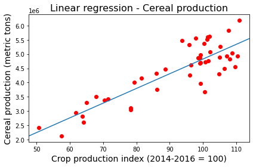
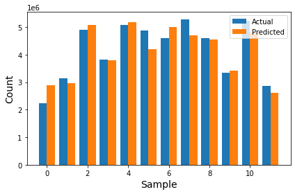

## Import packages and classes


```python
import numpy as np
import pandas as pd
import matplotlib.pyplot as plt
from sklearn.linear_model import LinearRegression
from sklearn.model_selection import train_test_split
from sklearn import metrics
import statsmodels.api as sm
```

## Load dataset


```python
data_raw = pd.read_csv('./../../../Datasets/Greece - Agriculture and Rural Development/agriculture-and-rural-development_grc.csv', usecols=None)
pd.set_option('display.max_columns', 10)
data_raw.head()
```


<div>
<style scoped>
    .dataframe tbody tr th:only-of-type {
        vertical-align: middle;
    }

    .dataframe tbody tr th {
        vertical-align: top;
    }

    .dataframe thead th {
        text-align: right;
    }
</style>
<table border="1" class="dataframe">
  <thead>
    <tr style="text-align: right;">
      <th></th>
      <th>Agricultural land (% of land area)</th>
      <th>Agricultural land (sq. km)</th>
      <th>Agricultural machinery, tractors</th>
      <th>Agricultural machinery, tractors per 100 sq. km of arable land</th>
      <th>Agricultural raw materials exports (% of merchandise exports)</th>
      <th>...</th>
      <th>Permanent cropland (% of land area)</th>
      <th>Rural population</th>
      <th>Rural population (% of total population)</th>
      <th>Rural population growth (annual %)</th>
      <th>Surface area (sq. km)</th>
    </tr>
  </thead>
  <tbody>
    <tr>
      <th>0</th>
      <td>NaN</td>
      <td>NaN</td>
      <td>NaN</td>
      <td>NaN</td>
      <td>NaN</td>
      <td>...</td>
      <td>NaN</td>
      <td>3671291</td>
      <td>44.064</td>
      <td>NaN</td>
      <td>NaN</td>
    </tr>
    <tr>
      <th>1</th>
      <td>69.123351</td>
      <td>89100.0</td>
      <td>22630.0</td>
      <td>80.994989</td>
      <td>NaN</td>
      <td>...</td>
      <td>7.028704</td>
      <td>3657099</td>
      <td>43.547</td>
      <td>-0.387316</td>
      <td>131960.0</td>
    </tr>
    <tr>
      <th>2</th>
      <td>69.061288</td>
      <td>89020.0</td>
      <td>24530.0</td>
      <td>85.679357</td>
      <td>23.071856</td>
      <td>...</td>
      <td>6.508922</td>
      <td>3604016</td>
      <td>42.660</td>
      <td>-1.462143</td>
      <td>131960.0</td>
    </tr>
    <tr>
      <th>3</th>
      <td>69.984484</td>
      <td>90210.0</td>
      <td>28500.0</td>
      <td>93.228656</td>
      <td>16.425263</td>
      <td>...</td>
      <td>6.508922</td>
      <td>3542618</td>
      <td>41.778</td>
      <td>-1.718278</td>
      <td>131960.0</td>
    </tr>
    <tr>
      <th>4</th>
      <td>69.751746</td>
      <td>89910.0</td>
      <td>33500.0</td>
      <td>111.629457</td>
      <td>16.315466</td>
      <td>...</td>
      <td>6.570985</td>
      <td>3480851</td>
      <td>40.901</td>
      <td>-1.758920</td>
      <td>131960.0</td>
    </tr>
  </tbody>
</table>
<p>5 rows × 23 columns</p>
</div>


## Select variables & Drop NaN values


```python
variable_x = "Crop production index (2014-2016 = 100)"
variable_y = "Cereal production (metric tons)"
data = data_raw[[variable_x, variable_y]].dropna().reset_index(drop=True)
data.head()
```


<div>
<style scoped>
    .dataframe tbody tr th:only-of-type {
        vertical-align: middle;
    }

    .dataframe tbody tr th {
        vertical-align: top;
    }

    .dataframe thead th {
        text-align: right;
    }
</style>
<table border="1" class="dataframe">
  <thead>
    <tr style="text-align: right;">
      <th></th>
      <th>Crop production index (2014-2016 = 100)</th>
      <th>Cereal production (metric tons)</th>
    </tr>
  </thead>
  <tbody>
    <tr>
      <th>0</th>
      <td>62.570000</td>
      <td>2243876.0</td>
    </tr>
    <tr>
      <th>1</th>
      <td>50.700001</td>
      <td>2426843.0</td>
    </tr>
    <tr>
      <th>2</th>
      <td>57.430000</td>
      <td>2122537.0</td>
    </tr>
    <tr>
      <th>3</th>
      <td>57.150002</td>
      <td>2874641.0</td>
    </tr>
    <tr>
      <th>4</th>
      <td>61.770000</td>
      <td>2940922.0</td>
    </tr>
  </tbody>
</table>
</div>


```python
data.shape
```


    (58, 2)


## Train-test split


```python
X_train, X_test, y_train, y_test = train_test_split(data[variable_x].to_numpy(), data[variable_y].to_numpy(), test_size=0.2, random_state=42)
```

## Sklean Linear Regression


```python
model = LinearRegression().fit(X_train.reshape(-1, 1), y_train)
```


```python
print(f"Intercept: {model.intercept_}")
print(f"Slope: {model.coef_}")
```

    Intercept: -338797.33066389244
    Slope: [51647.36492435]
    

## Prediction


```python
y_pred = np.around(model.predict(X_test.reshape(-1, 1)), 1)
y_pred
```


    array([2892778.3, 2960952.8, 5072813.5, 3795574.4, 5177141.4, 4196357.7,
           4998957.8, 4700952.6, 4551691.8, 3424746.3, 4813543.9, 2612849.7])


```python
fig, ax = plt.subplots()
plt.scatter(X_train, y_train, color='red')
ax.axline((X_test[1], y_pred[1]), slope=model.coef_[0])

plt.title('Linear regression - Cereal production', fontsize=16)
plt.xlabel(variable_x, fontsize=14)
plt.ylabel(variable_y, fontsize=14)

plt.tight_layout()
plt.show()
```


    

    


## Evaluation


```python
print('Mean Absolute Error:', metrics.mean_absolute_error(y_test, y_pred))  
print('Mean Squared Error:', metrics.mean_squared_error(y_test, y_pred))  
print('Root Mean Squared Error:', np.sqrt(metrics.mean_squared_error(y_test, y_pred)))
```

    Mean Absolute Error: 300467.2
    Mean Squared Error: 142457458025.50165
    Root Mean Squared Error: 377435.36933560116
    


```python
print("R-Square value:", metrics.r2_score(y_test, y_pred))
```

    R-Square value: 0.8563623217388497
    


```python
X_stat = sm.add_constant(X_train)
regsummary = sm.OLS(y_train, X_stat).fit()
regsummary.summary()
```


<table class="simpletable">
<caption>OLS Regression Results</caption>
<tr>
  <th>Dep. Variable:</th>            <td>y</td>        <th>  R-squared:         </th> <td>   0.744</td>
</tr>
<tr>
  <th>Model:</th>                   <td>OLS</td>       <th>  Adj. R-squared:    </th> <td>   0.738</td>
</tr>
<tr>
  <th>Method:</th>             <td>Least Squares</td>  <th>  F-statistic:       </th> <td>   127.6</td>
</tr>
<tr>
  <th>Date:</th>             <td>Mon, 30 Jan 2023</td> <th>  Prob (F-statistic):</th> <td>1.36e-14</td>
</tr>
<tr>
  <th>Time:</th>                 <td>15:13:51</td>     <th>  Log-Likelihood:    </th> <td> -668.16</td>
</tr>
<tr>
  <th>No. Observations:</th>      <td>    46</td>      <th>  AIC:               </th> <td>   1340.</td>
</tr>
<tr>
  <th>Df Residuals:</th>          <td>    44</td>      <th>  BIC:               </th> <td>   1344.</td>
</tr>
<tr>
  <th>Df Model:</th>              <td>     1</td>      <th>                     </th>     <td> </td>   
</tr>
<tr>
  <th>Covariance Type:</th>      <td>nonrobust</td>    <th>                     </th>     <td> </td>   
</tr>
</table>
<table class="simpletable">
<tr>
    <td></td>       <th>coef</th>     <th>std err</th>      <th>t</th>      <th>P>|t|</th>  <th>[0.025</th>    <th>0.975]</th>  
</tr>
<tr>
  <th>const</th> <td>-3.388e+05</td> <td> 4.26e+05</td> <td>   -0.796</td> <td> 0.430</td> <td> -1.2e+06</td> <td> 5.19e+05</td>
</tr>
<tr>
  <th>x1</th>    <td> 5.165e+04</td> <td> 4571.889</td> <td>   11.297</td> <td> 0.000</td> <td> 4.24e+04</td> <td> 6.09e+04</td>
</tr>
</table>
<table class="simpletable">
<tr>
  <th>Omnibus:</th>       <td> 0.370</td> <th>  Durbin-Watson:     </th> <td>   1.986</td>
</tr>
<tr>
  <th>Prob(Omnibus):</th> <td> 0.831</td> <th>  Jarque-Bera (JB):  </th> <td>   0.538</td>
</tr>
<tr>
  <th>Skew:</th>          <td>-0.082</td> <th>  Prob(JB):          </th> <td>   0.764</td>
</tr>
<tr>
  <th>Kurtosis:</th>      <td> 2.496</td> <th>  Cond. No.          </th> <td>    534.</td>
</tr>
</table><br/><br/>Notes:<br/>[1] Standard Errors assume that the covariance matrix of the errors is correctly specified.


```python
fig, ax = plt.subplots()
x_axis = np.arange(12)

plt.bar(x_axis-0.2, y_test, width=0.4, label = "Actual")
plt.bar(x_axis+0.2, y_pred, width=0.4, label = "Predicted")

plt.xlabel("Sample", fontsize=14)
plt.ylabel("Count", fontsize=14)

plt.legend()

plt.tight_layout()
plt.show()
```


    

    


## Linear Regression by Hand


```python
def linear_regression_coef(x, y):
    
    assert np.size(x) == np.size(y)
    
    # number of observations
    n = np.size(x)
  
    # mean of x and y vector
    m_x = np.mean(x)
    m_y = np.mean(y)
  
    # calculating regression coefficients
    b_1 = (np.sum(y*x) - n*m_y*m_x) / (np.sum(x*x) - n*m_x*m_x)
    b_0 = m_y - b_1*m_x
  
    return (b_0, b_1)
```


```python
x = np.array([0, 1, 2, 3, 4, 5, 6, 7, 8, 9])
y = np.array([1, 3, 2, 5, 7, 8, 8, 9, 10, 12])
res = linear_regression_coef(x,y)  
res
```


    (1.2363636363636363, 1.1696969696969697)


```python

```


```python

```
